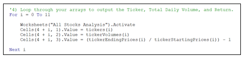

# Stock_Analysis_Challenge
Stock Analysis challenge - VBA macros challenge

## Overview of the Project:
### Project Background

The purpose of this analyses is to help a recent college grad (with Finance degree) Steve, who wants to help his parents diversify their stock portfolio. Steve's parents are passionate about green energy and have decided to invest in DAQO New Energy Corp, a company that makes silicon wafers for solar panels. DAQO's ticker symbol is DQ. Steve is doing analysis for his parents and wants to diversify their funds by including a handful of green energy stocks in addition to DAQO's stocks. Steve has created an Excel file containing the stock data that he wants to analyze.

### Purpose:
To help Steve, Excel macros in VBA (Visual Basic for Applications) have been created to automate stock analyses and reduce the chance of accidents and errors. The anlyses includes "Total Daily Volumne" and "Return" for 12 stocks that Steve has identified.  Steve wants to do some additional analysis by expanding the dataset to include the entire stock market over the last few years. Although the code works well for a dozen stocks, Steve is a concerned that it might not work as well for thousands of stocks and may take a long time to execute.

For this we need to refactor the VBA code to handle a much larger dataset and measure the performance to determine whether refactored code improved the runtime.

## Results 

For this analyses, the VBA code (VBA_Challenge.xlsm) was refactored by creating Arrays for tickers, tickerVolumes, tickerStartingPrices and tickerEndingprices and they were used for storing values and for outputing the values.  

### Comparison of stock performance between 2017 and 2018
There was a significant difference in the performance of the 12 stocks from 2017 to 2018.  As we can see in the VBA Challenge Performance for 2017 and 2018 data below, in 2017 all of the tracked stocks had a positive return with the exception of one stock (TERP) whereas in 2018 all stocks had a negative return with the exception of two stocks (ENPH and RUN).

### Comparison of execution times of original script with refactored script
Refactoring the code made the VBA script run faster.  The original VBA script took average of  0.5703125 seconds to run the data whereas the refactored code took average of only .09375 seconds to run the same data.  

Note: During the first execution of the original script for 2017 and 2018 data, a slightly higher runtimes (0.5820313 seconds) were recorded, but after running the script repeatedly a consistent runtime of 0.5703125 appeared each time.  Similar trend in runtimes for refactored script was noticed as well.

## Summary:

## Advantages or disadvantages of refactoring code

Refactoring the code is a good practice to follow since the code written the first time doesn’t always focus on code efficiencies.  Per Stackoverflow.com, some of the benefits of refactoring are as follows:
- Refactoring the code improves the design of the software 
- Makes software easier to understand 
- Helps find bugs
- Helps programming faster

One disadvantage of refactoring is that extensive testing needs to be performed on the refactored code to ensure that the new code meets the required functionality and to ensure that it didn’t break any existing functionality. In this challenge, additional arrays were created to hold data for ticker, volume, starting price and ending price which needed to be tested.   

## Advantages and disadvantages of the original and refactored VBA script 

The original code was simple and it was developed very quickly, but it wasn't structured for managing a large dataset.  The code would also have been difficult to maintain over time due to its lack of structure.  Refactoring the code took additional time and effort to make it efficient for processing a large dataset, but it is more readable and easier to maintain.